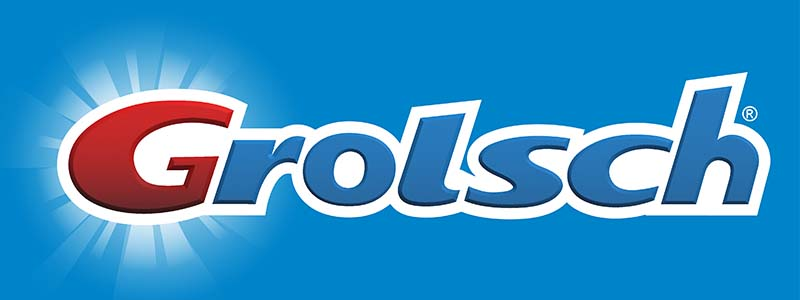

# Grolsch Pilsner Mouthwash by Jessi Hernandez

A 5 page website featuring the brand mashup of Grolsch x Crest featuring a new product: Pilsner Mouthwash. This brand mashup will feature Grolsch product descriptions, slightly altered to reflect the Crest Pro-Health Mouthwash. All web styling will be done using Crest Toothpaste design principles.

Notable design elements will include 3D rendering, vector-based packaging templates and a product video depicting the company.

This website is written with HTML5, styled with CSS3 and will feature Javascript animations throughout.

## Prerequisites

Website should be compatible with most web browsers. Any browsers not supporting CSS Grid and Flexbox may affect how the website renders.

## Contributing

1. Fork it
2. Create your feature branch: `git checkout -b my-new-feature`
3. Commit your changes: `git commit -m 'Add some feature'`
4. Push to the branch: `git push origin my-new-feature`
5. Submit a pull request (please include detailed explanation of any changes)

## Credits

Author:
- Jessica Hernandez Botero

## License

MIT
